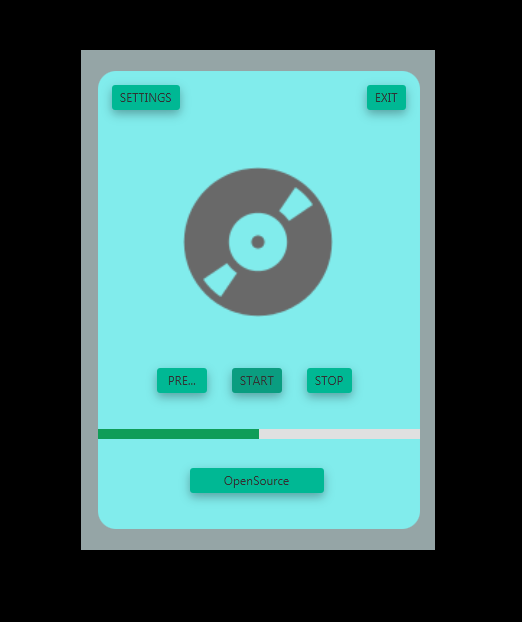

# music-app-javafx
Really simple music desktop application written using JavaFX.  
Built back then when I was interested in JavaFX.  
Now it's kind of souvenir from when I started. 
Keep in mind it will be all messy, reworking this project now would be a waste of time.  

To set-up the project and make it work first off download this library: 
<code>https://jar-download.com/?search_box=jfoenix</code>

 
Extract the archive and add it to the Project Structure 

<code>File > Project Structure > Libraries > + > !Selecte path of the jar you've extracted! </code>
 
 
 

